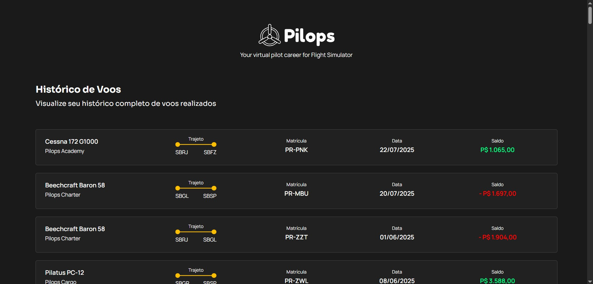

<h2 align="center">Deploy link:</h2>

@[Pilops]()

```

```


<h1 align="center" style="font-weight: bold;">Pilops</h1>
<p align="center">
Topics: 
<a href="#tech">Technolgies</a> |
<a href="#howMade">How was made</a> |
<a href="#obj">Objective</a> |
<a href="#if">If I had more time</a> |
<a href="#howRun">How to run the frontend and backend</a>
</p>


<p align="center">
<b>Um desafio técnico para vaga de Engenheiro(a) de software fullstack (estágio/Júnior) com 7 dias a partir do 
recebimento do teste de prazo.</b>
<b>!Algumas coisas poderiam ter sido diferentes caso eu pudesse tirar dúvidas de template! Houve a minha 
interpretação do design.</b>
</p>


<p align="center">
  <p align="center">
    
  </p>
</p>


<h2 id="tech" align="center">Technologies</h2>
Node.js, Express.js, React, TypeScript, HTML and CSS.


<h2 id="howMade" align="center">How was made</h2>
Utilizando modelos Figma fornecidos pela Pilops, construí uma interface com um front-end que exibe os dados de uma API e um back-end que os disponibiliza.
</br>
O mais essencial foi a atenção aos detalhes de cada elemento na tela, incluindo: fontes, tamanhos, disposição, 
espaçamentos, cores, ícones etc.
</br>
Também mantive os diretórios organizados ao seguir convenções profissionais.


<h2 id="obj" align="center">Objective</h2>
Implementar as melhores soluções de performance e escalabilidade em adequação a cada componente e de acordo com as regras obrigatórias do teste técnico.


<h2 id="if" align="center">If I had more time</h2>
Primeiro eu mudaria a ordem dos cards para que fossem do mais recentes ao mais antigos em relação às datas.
</br>
Também aperfeiçoaria o componente que altera o saldo, especificamente a solução de adicionar os pontos (".") para que fosse mais escalável independente dos valores.
</br>
Como foquei nos itens obrigatórios do teste, certamente complementaria com os itens opcionais posteriormente: testes unitários, paginação da lista de voos, endpoint para calcular o saldo total acumulado dos voos etc.
</br>
Por causa da quantidade de cards, penso que um botão para o topo seria algo bom de acrescentar, além de atualizar a página ao clicar no logo, mas mantendo o posicionamento vertical do usuário e a tela de detalhes do voo caso fizessem sentido.


<h2 id="howRun" align="center">How to run the frontend and backend</h2>
Understand how to create a streaming interface mainly with Next.js, TypeScript and Tailwind CSS.